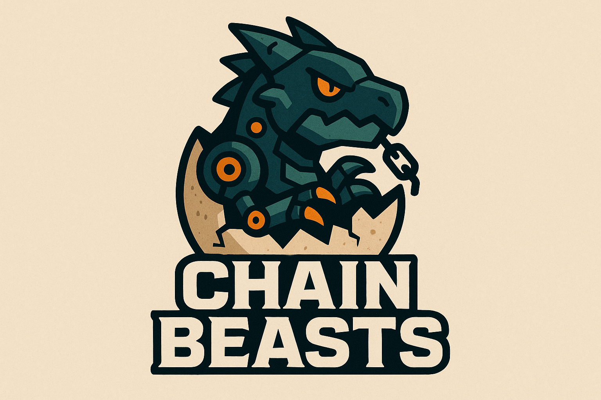

# Chain Beasts



Chain Beasts lets you hatch AI creatures on-chain, train them and test their might in verifiable battles.

Depends on the custom-built harmonics ML library as to make sure training and inference is deterministic and block-verifyable.

Each creature may include small **sensor** and **appendage** networks that plug into
its main model. Sensors interpret the environment while appendages translate
outputs into actions. These auxiliary networks are fixed at genesis in the
hatching block.


---

## Table of Contents

1. [Project Status](#project-status)
2. [Quick Start](#quick-start)
3. [How It Works](#how-it-works)
4. [Repo Layout](#repo-layout)
5. [Testing](#testing)
6. [Contributing](#contributing)
7. [Security](#security)
8. [License](#license)

---

## Project Status

* **MVP in active development** – deterministic INT8 kernel, single‑league contracts and off‑chain replay validators compile & run on a local PoUW devnet.
* **Sovereign PoUW chain** – training work replaces traditional mining; blocks are produced by validators running the kernel.
* **PoUW consensus** – see [`docs/PoUWConsensus.md`](docs/PoUWConsensus.md) for how miners submit training batches and earn rewards.
* **Architecture & Philosophy** – read [`docs/Architecture.md`](docs/Architecture.md) and [`docs/PHILOSOPHY.md`](docs/PHILOSOPHY.md) for the design rationale.
* **Graph Cache** – see [`docs/IncrementalCache.md`](docs/IncrementalCache.md) for the incremental compilation workflow.
* **Dataset Cache** – see [`docs/DatasetCaching.md`](docs/DatasetCaching.md) for using the dataset caching layer and the `HARMONICS_CACHE_DIR` override.
* **WebAssembly backend** – see [`docs/WebAssembly.md`](docs/WebAssembly.md) for building and running the kernel in the browser.
* **GPU acceleration** – the Harmonics library ships an optional Vulkan/Metal backend; see [`docs/GPUAcceleration.md`](docs/GPUAcceleration.md) for building and enabling it.
* **Game guide** – see [`docs/GameGuide.md`](docs/GameGuide.md) for the player-focused overview.
* **Battlefield design** – see [`docs/BattlefieldDesign.md`](docs/BattlefieldDesign.md) for the deterministic arena specification.
* **Architecture** – technical layout in [`docs/Architecture.md`](docs/Architecture.md).
* **Proof workflow** – zk flow in [`docs/ProofWorkflow.md`](docs/ProofWorkflow.md).
* **Whitepaper** – see [`whitepaper/ChainBeastsWhitepaper.tex`](whitepaper/ChainBeastsWhitepaper.tex) for a detailed protocol overview.
* **Contracts** – deployment details in [`docs/ContractDeployment.md`](docs/ContractDeployment.md).
* **Hatching** – see [`docs/Hatching.md`](docs/Hatching.md) for the creature genesis process.
* **Kernel and Neural Network Specification** - see [`docs/KernelNeuralSpec.md`](docs/KernelNeuralSpec.md) for the INT8 kernel design and neural network details.

## Quick Start

### Prerequisites

* **Clang ≥16** (LLVM), **CMake ≥3.25**, **Emscripten 3.x** (builds deterministic INT8 kernel & validator)
* **Node ≥20** (client UI)
* **Foundry** or **Hardhat** (smart‑contract tests)
* **Posix make** + **docker** (local PoUW node)
### Building the INT8 kernel

```bash
cmake -S . -B build && cmake --build build -j$(nproc)
```

To build a WebAssembly module run:
```bash
(cd scripts && ./build_wasm.sh)
```

To enable GPU acceleration compile with Vulkan support:

```bash
cmake -S . -B build-vulkan -DNEUROPET_ENABLE_VULKAN=ON
cmake --build build-vulkan -j$(nproc)
```


```bash
# ❶ Clone
$ git clone https://github.com/your-org/neuropet.git && cd neuropet

# ❷ Start the PoUW devnet
$ ./scripts/devnet/start.sh

# This also launches WebSocket helpers on ports 8765 and 8766 used by
# the React client.

# ❸ Deploy the contracts
$ ./scripts/devnet/deploy.sh
# The script prints the Matchmaker address used by the on-chain arena demo.

# ❹ Build the validator
$ cmake -B build && cmake --build build --target validator -j$(nproc)

# ❺ Start the React client
$ cd client && npm install && npm start

# ❻ Follow the chain in another shell
$ ./build/validator --follow mempool
```

> **Note**: The devnet uses mock time to advance blocks quickly. In mainnet mode, block rewards are issued for training work rather than traditional gas fees.

## How It Works

* **Genesis**: `seed = keccak256(finalized_block ∥ wallet)` → deterministic INT8 weights (≤64 KB).
* **Sensors & Appendages**: small networks baked into the genesis block. Sensors
  feed environment state to the main model, while appendages convert outputs into
  world actions.
* **Training**: local WASM kernel; checkpoints every 128 steps; contract accepts root + loss‑drop flag.
* **Validation**: quorum replay or STARK proof.
* **Battle**: deterministic turn engine; power/defense/stamina metrics decide outcomes.
* **Fashion Duel**: commit‑reveal vote with quadratic weighting; winners update Season trend vector.

Read **Architecture.md** for deep details.

## Repo Layout

```
contracts/       Solidity + Cairo sources (CreatureNFT, TrainingLedger, ...)
client/          React + Vite UI, WASM trainer, wallet glue
src/             C++20 deterministic kernel and validator
include/         Public headers
docs/            Project code-level documentation
whitepaper/       Comprehensive whitepaper (LaTeX)
scripts/         Deployment & maintenance helpers
```

## Testing

Run the automated tests with the helper script:

```bash
./scripts/run_tests.sh [Debug|Release]
```

This configures a build directory and runs the CMake `test` target via `ctest`.

## Benchmarks

Measure INT8 kernel performance using the benchmark helper:

```bash
./scripts/run_benchmarks.sh
```

Results for the reference system can be found in
[`docs/BenchmarkResults.md`](docs/BenchmarkResults.md).

## Contributing

1. Fork & branch from `dev`.
2. Run `scripts/format.sh` and `scripts/run_tests.sh` before opening a PR.
3. Open a PR with a **single, focused change**; link to an issue when possible.
4. Core maintainers squash‑merge after ≥2 approving reviews.

Large features need a **Request for Comment** under `docs/rfcs/`—see template.

## Security

We follow a *responsible disclosure* model. Please email [security@cognithesis.com](mailto:security@cognithesis.com) with exploit details; you’ll get an acknowledgment within 48 h.

## License

Apache‑2.0 for code; CC‑BY‑4.0 for docs & art assets unless stated otherwise. See [`LICENSE`](LICENSE).

---

© 2025 Cognithesis Labs – No guarantees, use at your own risk.
