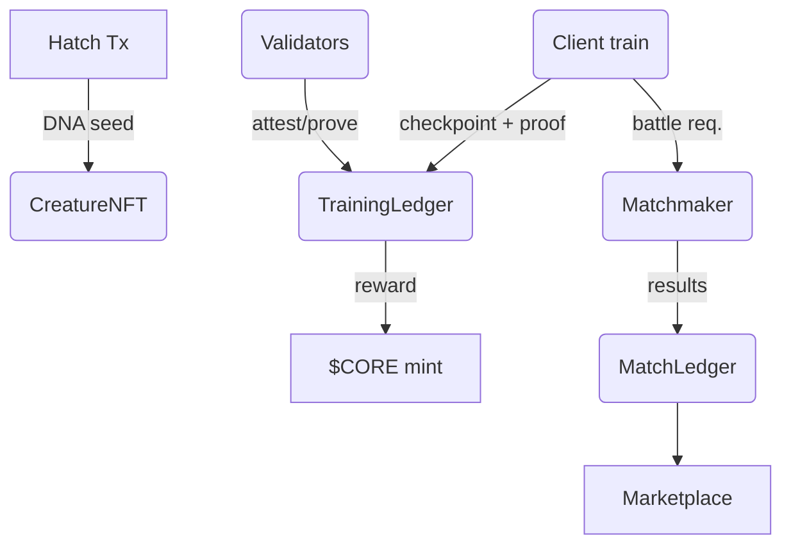

# **Chain Beasts** – Technical Architecture

---

## 1  Purpose & Scope

Design a deterministic, blockchain‑anchored game where players hatch, train, battle, style and trade AI‑driven “creatures.” Each creature is a quantised neural network whose full life‑cycle (genesis → training → breeding → retirement) is publicly verifiable and non‑forkable.

Written entirely in C++20. Future bindings for other languages planned after MVP and testnet are live.

All neural network functions are handled by the `harmonics` dependency, a neural network framework included under `third_party/`.

## 2  Deterministic ML Kernel

| Item                | Spec                                                                                                                                                                                                              |
| ------------------- | ----------------------------------------------------------------------------------------------------------------------------------------------------------------------------------------------------------------- |
| **Numeric format**  | INT8 signed, little‑endian, fixed‑point scale = 2-7 (baseline for minimal proofs); **Alt league:** INT32 signed, fixed‑point scale = 2-23 (≈4× memory, 5× proof cost, higher dynamic range) |
| **MatMul**          | Saturating multiply‑add, round‑to‑zero on overflow                                                                                                                                                                |
| **Activations**     | Lookup tables (ReLU, GELU, Softmax, Sigmoid) stored on‑chain as 256‑entry INT8 arrays                                                                                                                             |
| **Reference impl.** | `wasm32‑unknown‑unknown` module (no SIMD), acts as ground truth for validators & ZK circuits                                                                                                                      |
| **Kernel ID**       | `keccak256(kernel‑spec)` → 32‑byte constant embedded in every checkpoint hash                                                                                                                                     |

> \*\*NB \*\* Any future kernel revision constitutes a *hard fork* and must increment `kernel_id`.

### 2.1 Appendages & Sensors

Creatures can attach small auxiliary networks to their main model. **Sensors** process environment observations and feed embeddings into the core network, while **appendages** map output logits to concrete world actions. These sub-networks are hard-coded in the genesis hatching block and remain immutable throughout a creature's lifetime.

**Sensors**

* Accept raw world data (tile type, enemy position, elevation, etc.) and convert
  it into a fixed-size embedding fed into the core network.
* Each sensor's weights are part of the creature DNA so validators can
  deterministically recreate the observation pipeline.
* Sensors may be temporarily disabled by status effects but cannot be replaced
  once hatched.

**Appendages**

* Interpret the creature's output logits and expand them into discrete actions
  such as movement or special attacks.
* Define cooldowns and energy costs for each available action.
* Advanced appendage models may unlock additional moves but still use the core
  network's logits as-is.

### 2.2 Items

Items are modular upgrades that owners may attach or detach from their creatures.
Some items boost sensor range or quality, others enhance appendage capabilities
to unlock new moves, and many provide purely cosmetic flair. Each item is
represented on-chain as its own NFT describing the effect type and metadata URI.
Attaching an item updates the creature state and may consume **ENERGY** or
\$CORE depending on the league's rulebook.

**Item Attachments**

* Owners call the `attachItem(creatureId, itemId)` function on the
  `Marketplace` contract.
* The attachment record becomes part of the immutable creature history so all
  nodes can replay stats deterministically.
* Items that modify sensors or appendages apply deterministic weight deltas to
  the auxiliary networks when equipped.
* Detached items return to the owner's inventory and the creature state is
  updated accordingly.

## 2.5 Sovereign PoUW Chain

Chain Beasts runs on its own blockchain where **proof‑of‑useful‑work** replaces
traditional mining. Validators advance the chain by running batches of the
official INT8 kernel. Each block commits the resulting checkpoint root and
rewards the miner with freshly minted \$CORE, directly linking model training to
block production.

## 3  On‑Chain Contracts

### 3.1  `CreatureNFT`

* **Mint (hatch) =** one per wallet.
* Token DNA = `keccak256(final_block_header ∥ wallet_address)`.
* Stores immutable genesis weights (INT8 array ≤ 64 KB optionally cached off‑chain (e.g., IPFS/Filecoin)) and mutable stats.

### 3.2  `TrainingLedger`

* Accepts *checkpoint* tx: `{ creature_id, epoch_id, root_hash, loss_delta_flag, energy_spent, rule_hash }`.
* Emits event → reward pool.

### 3.3  `ProofVerifier`

* **Phase 0 (MVP)** ‑ requires ≥ N volunteer attestations (same `root_hash`).
* **Phase 1** ‑ SNARK/STARK verification of 128‑step batch proofs.
* **Phase 2** ‑ full‑epoch succinct proof.

### 3.4  `SeasonRegistry`

* Stores hash‑indexed constant tables (element affinities, fashion trend vectors, energy curves).
* Matchmaker passes `season_hash` into inference so deterministic behaviour is preserved.

### 3.5  `Marketplace`

* Lists creatures for sale with an asking price.
* Transfers payment and ownership on purchase.
* Breeds new creatures on behalf of owners for a DAO-controlled fee.
* Trades item NFTs that modify sensors, appendages or creature appearance.

### 3.6  `MatchLedger`

* Records battle outcomes pushed by the deterministic matchmaker.
* Stores `{match_id, creature_a, creature_b, winner_id, battle_hash}`.
* Emits events consumed by reward pools and ranking logic.
* Enables dispute review by keeping an immutable game log.

### 3.7  `FashionDuel`

* Controls the commit‑reveal voting flow of fashion duels.
* Holds staked \$CORE and burns \$ENERGY for each vote.
* Mints ephemeral `Duel‑ID` tokens referenced by checkpoints.
* Distributes rewards and updates the Season trend vector after tally.

### 3.8  `Governance`

* DAO contract that uses staked \$CORE for voting power.
* Proposals modify parameters in `SeasonRegistry` and `Marketplace`.
* Successful votes queue transactions behind a 7‑day timelock.
* Each on‑chain module exposes `setGovernance` so control can migrate.
* Quorum and majority thresholds are fixed in the contract for predictability.

## 4  Off‑Chain Services

| Service                 | Role                                                                                         |
| ----------------------- | -------------------------------------------------------------------------------------------- |
| **Client Trainer**      | Runs official WASM kernel; signs & submits checkpoints; UI for hatch/train/battle/fashion.   |
| **Volunteer Validator** | Replays batches; emits attestations; earns \$CORE if quorum formed.                          |
| **ZK Prover**           | Generates STARK proofs once Phase 1+ live; can be run by power users or third‑party provers. |
| **Matchmaker & Arena**  | Deterministic turn engine; enforces rulebook; records battle results on `MatchLedger`.       |
| **Marketplace**         | List, buy, breed, or lease creatures; fully on‑chain settlement.                             |

## 5  Data & Control Flow

## 6  Tokenomics

| Token        | Properties                   | Creation                          | Sinks                           |
| ------------ | ---------------------------- | --------------------------------- | ------------------------------- |
| **\$CORE**   | ERC‑20, tradable, capped 1 B | *Proof‑of‑Validation* reward pool | Breeding fees; governance stake |
| **\$ENERGY** | Non‑transferable, integer    | Earned per battle, quests         | Burned to run training steps    |

## 7  Gameplay Loops (Deterministic)

1. **Hatching** → unique DNA, base stats.
2. **Training** → spend ENERGY, submit checkpoints every 128 steps.
3. **Battles/Fashion Shows** → deterministic turn engine + season constants.
4. **Breeding** → burns \$CORE + ENERGY; offspring DNA = keccak256(parent\_hashes ∥ block).
5. **Trading** → CreatureNFT transfers via Marketplace.

## 7.1 Battle Metrics

* **Power Score** – mean logit‑margin of attack head across last 3 epochs.
* **Defense Score** – negative KL divergence between creature’s damage prediction and actual battle outcome (lower is better).
* **Style Score** – cosine similarity between creature fashion embedding and current Season trend vector.
* **Stamina** – exp(- cumulative training steps / decay\_constant); caps max turns per encounter.

### 7.2 Fashion Duel Protocol

| Phase            | Deterministic rule                                                                                                                        | Notes                                              |
| ---------------- | ----------------------------------------------------------------------------------------------------------------------------------------- | -------------------------------------------------- |
| **Initiate**     | Challenger stakes `MIN_STAKE_CORE` and nominates an opponent; sets `judge_block ≥ now + Δb`.                                              | Contract `FashionDuel` mints an ephemeral Duel‑ID. |
| **Commit**       | From `judge_block` to `judge_block + Wc`, voters submit `hash(side ∥ salt)` and burn **1 \$ENERGY**.                                      | Bribe‑resistant: choice hidden.                    |
| **Reveal**       | In window `judge_block + Wc` → `judge_block + Wc + Wr`, voters reveal vote + salt.                                                        | Late reveals ignored.                              |
| **Tally**        | Weight = `√(locked $CORE)` up to cap `CAP_W`. Highest weighted side wins.                                                                 | Quadratic voting dampens whales.                   |
| **Reward**       | Winner takes 80 % of total stake; 10 % burned, 10 % to validator pool. Voters on winning side share ENERGY rebate proportional to weight. | Token sink + validator incentive.                  |
| **Trend Update** | Winning creature’s fashion embedding appended to `Season trend vector` with decay λ.                                                      | Keeps meta fresh without hard fork.                |

`Duel-ID` and all reveals feed into the checkpoint root → chain‑verifiable.

## 8  Governance & Compliance

* DAO controls `SeasonRegistry` and `Marketplace` parameters through on‑chain proposals (7‑day timelock).
* KYC‑gated allowed‑list enforced by `CreatureNFT` & \$CORE transfer hooks.
* Legal memo aligns tokens with US “digital commodity” status; \$ENERGY non‑tradable to avoid MSB triggers.

### 8.1 State‑Licence Strategy for \$CORE Redemption

If \$CORE ever becomes redeemable for off‑chain value the project must operate
through a licensed money service business. Redemption requests would burn
\$CORE on‑chain and emit an event that a compliant custodian monitors. After
verifying KYC/AML data the custodian releases the corresponding funds in
approved jurisdictions. The DAO may maintain a whitelist of licensed partners to
serve different regions while keeping the token utility unchanged on-chain.

## 9  Proof‑System Roadmap

| Phase | Mechanism                       | Performance                                    | Target Release |
| ----- | ------------------------------- | ---------------------------------------------- | -------------- |
| 0     | Quorum replay (≥ N validators)  | O(steps × validators)                          | MVP (Testnet)  |
| 1     | Batch SNARK/STARK per 128 steps | O(1) verify, O(steps) prove                    | Mainnet +6 mo  |

| 2     | One proof per epoch             | O(1) verify, O(log steps) prove with recursion | Season 3       |

### 9.1 Monotonic Loss Metric

Each checkpoint stores the rolling mean cross‑entropy loss of the last training batch. Proofs must demonstrate that this value never increases between consecutive checkpoints. Validators compare `loss_n` against `loss_{n−1}` and reject the proof if the loss rose, enforcing continual progress without storing the entire dataset.

## 9 Specification

See [`docs/KernelNeuralSpec.md`](docs/KernelNeuralSpec.md) for the full kernel specification, and [`docs/PoUWConsensus.md`](docs/PoUWConsensus.md) for the proof‑of‑useful‑work consensus rules.

For battlefield design, see [`docs/BattlefieldDesign.md`](docs/BattlefieldDesign.md).

---

© 2025 Cognithesis Labs – Draft v0.8
