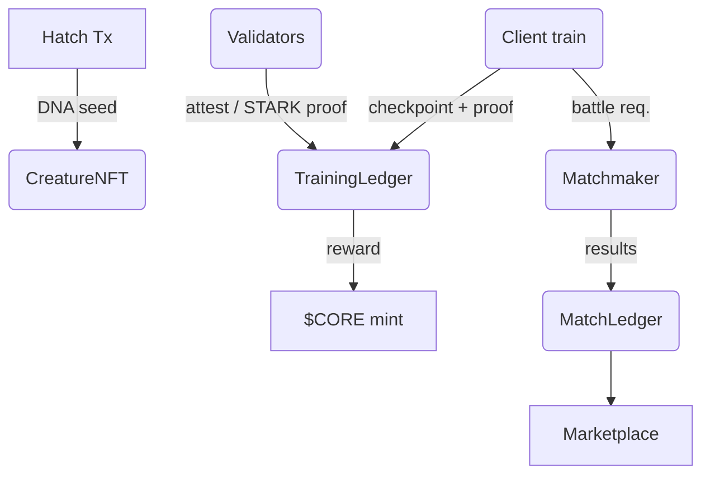

# **Chain Beasts** – Technical Architecture

*Draft v0.9 · 1 June 2025*

---

## 1  Purpose & Scope

Design a deterministic, blockchain‑anchored game where players hatch, train, battle, style and trade AI‑driven “creatures.” Each creature is a quantised neural network whose full life‑cycle (genesis → training → breeding → retirement) is publicly verifiable and non‑forkable.

Written in **C++17** (Clang ≥ 16). Future C++20 modules and language bindings will land after the MVP test‑net is stable.

All neural network functions are implemented by the `harmonics` library included under `third_party/`.

---

## 2  Deterministic ML Kernel

| Item                | Spec                                                                                                                                                |
| ------------------- | --------------------------------------------------------------------------------------------------------------------------------------------------- |
| **Numeric format**  | INT8 fixed‑point scale = 2⁻⁷ (baseline). **Alt league:** INT32 fixed‑point scale = 2⁻²³ using the *same* 4 × 96 slabs to keep proof size unchanged. |
| **MatMul**          | Saturating multiply‑add, round‑to‑zero overflow                                                                                                     |
| **Activations**     | INT8 LUTs (ReLU, Hard‑Sigmoid, Softmax) stored on‑chain                                                                                             |
| **Reference impl.** | `wasm32‑unknown‑unknown` (no SIMD) is the ground truth for validators & ZK circuits                                                                 |
| **Kernel ID**       | `keccak256(kernel object file)` – any binary change → hard fork                                                                                     |

> **NB** Dormant sensor/appendage slots can be unlocked later via a growth‑spurt ENERGY spend; once active, heads stay immutable.

### 2.1 Appendages & Sensors

* **Sensors** embed observations → core. **Appendages** map logits → actions.
* Topology (slot count & width) fixed at hatch; inactive slabs masked.
* See *HATCHING.md* for deterministic seed mapping.

### 2.2 Cosmetic Items

Items provide **visual flair or scalar stat buffs** (e.g., +stamina). They **never modify weights**, preserving deterministic proofs. Items are their own NFTs and attach/detach via `Marketplace`.

### 2.3 Sovereign PoUW Chain

Validators run 128‑step kernel batches; blocks include checkpoint roots **and optional dataset‑reveal bytes** (≤512 kB) when players use private curricula.

---

## 3  On‑Chain Contracts

*Sections shortened; full ABIs in repo.*

| Contract         | Key duties                                                                                                                         |
| ---------------- | ---------------------------------------------------------------------------------------------------------------------------------- |
| `CreatureNFT`    | 1‑per‑wallet hatch; stores DNA, immutable topology, initial hash                                                                   |
| `TrainingLedger` | Records checkpoints `{ creature_id, epoch_id, global_step, root_hash, loss_flag, energy_spent, lr_shift, active_mask, rule_hash }` |
| `ProofVerifier`  | Phase 0 quorum replay → Phase 1 STARK → Phase 2 recursive proof                                                                    |
| `SeasonRegistry` | Constant tables (element matrix, trend vectors, energy curve)                                                                      |
| `Marketplace`    | Trade, breed, lease creatures & cosmetic items                                                                                     |
| `MatchLedger`    | Stores battle outcomes & hashes for dispute replay                                                                                 |
| `FashionDuel`    | Commit‑reveal quadratic voting + trend updates                                                                                     |
| `Governance`     | DAO, timelock, KYC allow‑list hooks                                                                                                |

---

## 4  Off‑Chain Services

| Service             | Role                                               |
| ------------------- | -------------------------------------------------- |
| Client Trainer      | WASM/Native kernel; submits checkpoints; UI layer  |
| Volunteer Validator | Replays batches; earns \$CORE for attestations     |
| ZK Prover           | Generates STARK proofs for Phase 1+                |
| Matchmaker & Arena  | Deterministic battle engine; pushes to MatchLedger |

---

## 5  Data & Control Flow

---

## 6  Tokenomics

| Token                           | Creation                         | Sink                                            |
| ------------------------------- | -------------------------------- | ----------------------------------------------- |
| **\$CORE** (cap 1 B)            | PoUW block rewards               | Breeding, trait locks, governance stake         |
| **\$ENERGY** (non‑transferable) | Battles, validator quorum shares | 128‑step training, growth‑spurts, fashion votes |

---

## 7  Gameplay Loop Summary

1. **Hatch** – deterministic DNA.
2. **Customise** – optional cosmetic & naming lock.
3. **Train** – ENERGY burn, 128‑step checkpoints.
4. **Private Coach** – per‑battle dataset reveal (see *PreBattleCurriculum.md*).
5. **Battle / Fashion** – deterministic engine + quadratic voting.

### 7.1 Battle Metrics

* Power Score, Defense Score, Style Score, Stamina (see *TrainingPipeline.md* §1).

### 7.2 Fashion Duel Protocol

Commit‑reveal with quadratic weight; token sinks & validator rewards as previously specced.

---

## 8  Governance & Compliance

* DAO controls Season & fees (7‑day timelock).
* KYC allow‑list for \$CORE transfers.
* \$ENERGY remains in‑game to sidestep MSB rules.

### 8.1 Redemption Path (future)

Custodian burns \$CORE on‑chain, releases fiat off‑chain under licences.

---

## 9  Proof‑System Roadmap

| Phase | Verify                       | Prove        | Target   |
| ----- | ---------------------------- | ------------ | -------- |
| 0     | O(steps × validators) replay | —            | Test‑net |
| 1     | O(1) STARK                   | O(steps)     | +6 mo    |
| 2     | O(1) recursive               | O(log steps) | Season 3 |

Monotonic loss enforced; if private dataset unrevealed, validators skip label checks and rely on lineage hash.

---

## 10  Document Map

* Project philosophy → `docs/Philosophy.md`
* Training pipeline → `docs/TrainingPipeline.md`
* Proof of Useful Work → `docs/PoUWConsensus.md`
* Kernel spec → `docs/KernelNeuralSpec.md`
* Hatching seeds → `docs/Hatching.md`
* Combat & labels → `docs/PreBattleCurriculum.md`
* Private curricula → `docs/PreBattleCurriculum.md`
* Reveal protocol → `docs/PreBattleCurriculum.md`

---

© 2025 ChainBeasts Labs
