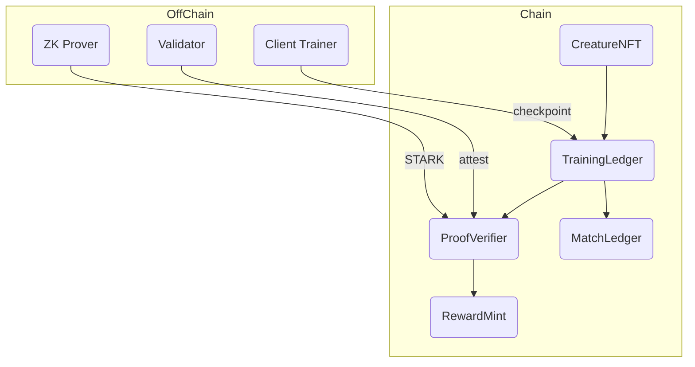

# Chain‑Beasts — Whitepaper

*Version 0.1 • 1 June 2025*

---

## Abstract

**Chain‑Beasts** is a sovereign proof‑of‑useful‑work (PoUW) blockchain where the work is *deterministic neural‑network training*. Players hatch, customise and battle quantised INT8 creatures whose entire life‑cycle is cryptographically verifiable. The game doubles as an open experiment in model fine‑tuning, gradient privacy, and applied cryptography, lowering the barrier for anyone to learn modern ML.

---

## 1 Motivation

1. **Democratise ML literacy** – turn fine‑tuning and loss curves into mainstream gameplay.
2. **Convert wasted hash‑power into useful compute** – block rewards come from running the Harmonics kernel.
3. **Create an open research corpus** – on‑chain checkpoints + optional dataset reveals enable real‑world gradient‑steal studies.

---

## 2 System Overview

* Full architecture → [`Architecture.md`](docs/Architecture.md).
* Kernel spec → [`KernelNeuralSpec.md`](docs/KernelNeuralSpec.md).

### 2.1 Layer Diagram



---

## 3 Creatures

### 3.1 DNA

```
seed_core = keccak256(blockHash ∥ wallet)
seed_topo = keccak256(seed_core)
```

Encodes core‑layer widths, sensor & appendage slot counts (max 4 each). Inactive slabs masked until a growth‑spurt unlocks them.

### 3.2 Growth‑Spurts

* Burn ENERGY → flip `activeMask` bit 0→1.
* Contract checks matching `energyBurn` in checkpoint payload.

---

## 4 Kernel

**INT8** forward, **INT32** accum; fixed‑slab layout for static proof size. Variable heads masked. Optimiser is integer SGD with right‑shift learning rate. Full details in [`KernelNeuralSpec.md`](docs/KernelNeuralSpec.md).

---

## 5 Consensus — Proof‑of‑Useful‑Work

| Step | Action                                               | Gas / Cost             |
| ---- | ---------------------------------------------------- | ---------------------- |
| 1    | Trainer runs 128 steps (≈18 M MACs).                 | Off‑chain CPU/GPU time |
| 2    | Creates checkpoint `{root_hash, loss_flag, …}`.      | 25 k gas               |
| 3    | Validators replay or verify STARK.                   | 15–30 k gas            |
| 4    | If ≥⅔ stake attest OR STARK valid → block finalises. | —                      |

Block reward: `CORE = ENERGY_spent × CORE_PER_ENERGY`. Attesters share 10 %.

---

## 6 Tokenomics

| Token    | Supply                     | Role                                  |
| -------- | -------------------------- | ------------------------------------- |
| \$CORE   | Capped 1 B                 | Governance, breeding, item/trait fees |
| \$ENERGY | Uncapped, non‑transferable | Pay‑per‑compute fuel, fashion votes   |

Emission schedule: 3 % annual CORE tail inflation → DAO treasury.

---

## 7 Gameplay

1. **Hatch** – deterministic baby with negative bias weights.
2. **Train** – ENERGY burn; checkpoints every 128 steps.
3. **Custom Coach** – optional private curriculum per battle (`PreBattleCurriculum.md`).
4. **Battle** – deterministic 8×8 grid engine with INT8 actions, INT32 damage. See [`BattlefieldDesign.md`](docs/BattlefieldDesign.md) for rules.
5. **Fashion Duel** – quadratic voting on style, ENERGY sink.

---

## 8 Governance & Compliance

* DAO with staked CORE; 7‑day timelock.
* KYC allow‑list for CORE transfers to meet US commodity guidance.
* ENERGY in‑game only → avoids MSB registration.

---

## 9 Roadmap

| Milestone                                              |
| ------------------------------------------------------ |
| Test‑net (Phase 0 replay consensus, C++17 kernel)      |
| Main‑net + Phase 1 STARK verifier; marketplace live    |
| Recursive proofs, INT32 Pro League, mobile WASM client |
| Creator economy (custom cosmetics, Lua rulebooks)      |

---

## 10 Security Considerations

* **Determinism CI** – hashes binaries & cross‑platform state.
* **Dataset griefing** – missing reveal → auto‑forfeit, bond slash.
* **Model theft** – identity tied to lineage hash; cloning fails at checkpoint verification.

---

## 11 Conclusion

Chain‑Beasts transforms neural‑network fine‑tuning into a multiplayer strategy loop, grounding every parameter update in an auditable ledger. We invite educators, cryptographers and gamers alike to fork the contracts, build leagues, and push the boundaries of verifiable ML gameplay.

---

© 2025 ChainBests Labs – Let’s make learning ML as universal as learning to ride a bike.
